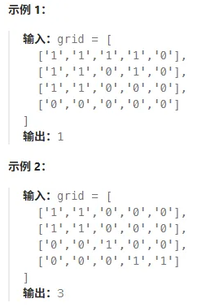
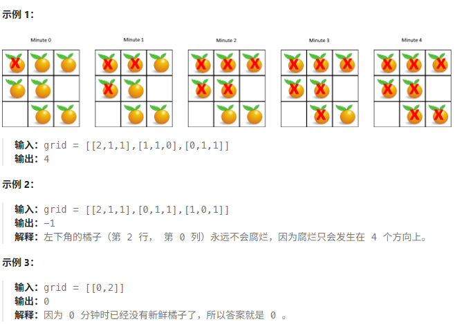
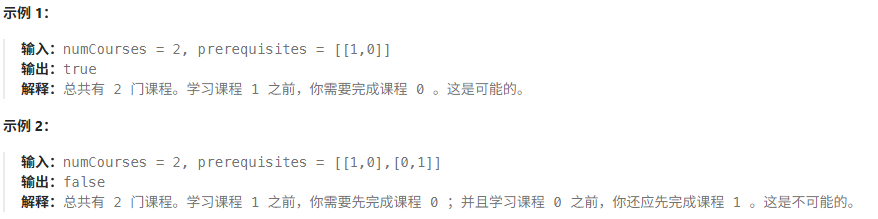

# [200 岛屿数量](https://leetcode.cn/problems/number-of-islands)

**中等题**

给你一个由`'1'`（陆地）和`'0'`（水）组成的的二维网格，请你计算网格中岛屿的数量。

岛屿总是被水包围，并且每座岛屿只能由水平方向和/或竖直方向上相邻的陆地连接形成。

此外，你可以假设该网格的四条边均被水包围。



时间复杂度和空间复杂度均为 $O(mn)$ 。

```java
class Solution {
    public int numIslands(char[][] grid) {
        int ans = 1;
        for (int i = 0; i < grid.length; i++) {
            for (int j = 0; j < grid[0].length; j++) {
                if (grid[i][j] == '1') { // 找到一个新的岛，就去进行dfs
                    dfs(grid, i, j);
                    ans++;
                }
            }
        }
        return ans;
    }


    public void dfs(char[][] grid, int i, int j) {
        // 出界或者遇到非'1'元素，就不再往下递归
        if (i < 0 || i >= grid.length || j < 0 || j >= grid[0].length || grid[i][j] != '1') {
            return;
        }

        // 插旗：避免来回横跳无限递归
        grid[i][j] = '2';
        // 向左右上下移动
        dfs(grid, i, j - 1);
        dfs(grid, i, j + 1);
        dfs(grid, i - 1, j);
        dfs(grid, i + 1, j);
    }
}
```

# [994 腐烂的橘子](https://leetcode.cn/problems/rotting-oranges) 

**中等题**

在给定的`m x n` 网格`grid` 中，每个单元格可以有以下三个值之一：

- 值`0`代表空单元格；
- 值`1`代表新鲜橘子；
- 值`2`代表腐烂的橘子。

每分钟，腐烂的橘子 **周围 4 个方向上相邻** 的新鲜橘子都会腐烂。

返回 直到单元格中没有新鲜橘子为止所必须经过的最小分钟数。如果不可能，返回`-1`。



------

## 多源BFS

步骤：

1. 统计所有初始腐烂的句子的位置，加入到列表 $q$ 中，现在 $q=[(0,0)]$ 。
2. 初始化答案 $ans=0$ 。模拟句子腐烂的过程，不断循环，指导没有新鲜橘子，或者 $q$ 为空。

为了判断是否有永远不会腐烂的橘子（如示例2），可以统计初始新鲜橘子的个数 $fresh$ 。在 BFS 中，没有一个新鲜橘子被腐烂，就把 $fresh$ 减一，这样如果最后发现 $fresh > 0$ ，就意味着有橘子永远不会腐烂，返回 $-1$ 。

代码实现中：在 BFS 中要把 $grid[i][j] = 1$ 的句子修改为 2 ，这样可以保证每个橘子加入 $q$ 至多一次。

问题：如果代码不在`while` 中判断 $fresh > 0 $ ，会发生什么？

答：会在腐烂完所有新鲜橘子后，多循环一次。导致 $ans$ 会比实际多1。

时间复杂度和空间复杂度均为 $O(mn)$ 。

```java
class Solution {
    private static final int[][] DIRECTIONS = {{-1, 0}, {1, 0}, {0, -1}, {0, 1}}; // 四个方向

    public int orangesRotting(int[][] grid) {
        int m = grid.length;
        int n = grid[0].length;
        int fresh = 0;

        List<int[]> q = new ArrayList<>();
        for (int i = 0; i < m; i++) {
            for (int j = 0; j < n; j++) {
                if (grid[i][j] == 1) {
                    fresh++; // 统计新鲜橘子的个数
                } else if (grid[i][j] == 2) {
                    q.add(new int[]{i, j}); // 存储初始时腐烂的橘子
                }
            }
        }

        int ans = 0;
        while (fresh > 0 && !q.isEmpty()) {
            ans++; // 经过了1分钟
            List<int[]> tmp = q;
            q = new ArrayList<>();
            for (int[] pos : tmp) { // 已经腐烂的橘子
                for (int[] d : DIRECTIONS) { // 四个方向
                    int i = pos[0] + d[0];
                    int j = pos[1] + d[1];
                    if (0 <= i && i < m && 0 <= j && j < n && grid[i][j] == 1) { // 新鲜橘子
                        fresh--;
                        grid[i][j] = 2; // 橘子腐烂
                        q.add(new int[]{i, j});
                    }
                }
            }
        }

        return fresh > 0 ? -1 : ans;
    }
}
```

# [207 课程表](https://leetcode.cn/problems/course-schedule)

**中等题**

你这个学期必须选修`numCourses` 门课程，记为`0` 到`numCourses - 1` 。

在选修某些课程之前需要一些先修课程。 先修课程按数组`prerequisites`给出，其中`prerequisites[i] = [ai, bi]`，表示如果要学习课程`ai`则 必须 先学习课程`bi`。

- 例如，先修课程对`[0, 1]`表示：想要学习课程`0`，你需要先完成课程`1`。

请你判断是否可能完成所有课程的学习？如果可以，返回`true`；否则，返回`false`。



------

分析：

要学习课程 $a_i$ 必须要先学习 $b_i$ ，可以把课程对中元素想象为有向图中的节点，即想要到达只有 $b_i$ 能够到达 $a_i$ 。

判断图中是否有环。有环说明无法修完所有课程，无环说明可以修完。

这是一道拓扑排序问题：

1. 每次只能选入度为 0 的课，入列。因为它们是能直接选的课。
2. 逐个出列，出列代表课程被选择，需要让他们所指向的课程的入度减一。
3. 如果第2步导致某个课程入度变为 0 ，则让它入列。
4. 重复2、3步，直到没有入度为 0 的课程。

```java
class Solution {
    public boolean canFinished(int numCourses, int[][] prerequisites) {
        // 入度数组
        int[] inDegree = new int[numCourses];
        // 邻接表
        List<List<Integer>> adjList = new ArrayList<>();
        for (int i = 0; i < numCourses; i++) {
            adjList.add(new ArrayList<>());
        }
        
        // 计算每门课程的入度，并构建邻接表
        for (int[] prerequisite : prerequisites) {
            int course = prerequisite[0];
            int preCourse = prerequisite[1];
            inDegree[course]++;
            ajdList.get(preCourse).add(course);
        }
        
        // 队列存放入度为 0 的课程
        Queue<Integer> queue = new LinkedList<>();
        for (int i = 0; i < numCourses; i++) {
            if (inDegree[i] == 0) {
                queue.offer(i);
            }
        }
        
        // 记录已完成课程的数量
        int finished = 0;
        while (!queue.isEmpty()) {
            int selectedCourse = queue.poll();
            finished++;
            // 获取当前课程的后序课程列表
            List<Integer> nextCourses = adjList.get(selectedCourse);
            for (Integer nextCourse : nextCourses) {
                // 后续课程入度减一
                inDegree[nextCourse]--;
                if (inDegree[nextCourse] == 0) {
                    queue.offer(nextCourse); // 入度为 0 的课程加入队列
                }
            }
        }
        
        // 检查是否能够修完所有课程，并返回
        return finished == numCourses;
    }
}
```

# [208 实现Trie(前缀树)](https://leetcode.cn/problems/implement-trie-prefix-tree)

**中等题**

**[Trie](https://baike.baidu.com/item/字典树/9825209?fr=aladdin)**（发音类似 "try"）或者说 **前缀树** 是一种树形数据结构，用于高效地存储和检索字符串数据集中的键。这一数据结构有相当多的应用情景，例如自动补全和拼写检查。

请你实现 Trie 类：

- `Trie()` 初始化前缀树对象。
- `void insert(String word)` 向前缀树中插入字符串 `word` 。
- `boolean search(String word)` 如果字符串 `word` 在前缀树中，返回 `true`（即，在检索之前已经插入）；否则，返回 `false` 。
- `boolean startsWith(String prefix)` 如果之前已经插入的字符串 `word` 的前缀之一为 `prefix` ，返回 `true` ；否则，返回 `false` 。

```java
// 一次建树，多次查询
class Trie {
    class TrieNode {
        private boolean isEnd; // 该节点是否为一个串的结束
        TrieNode[] next; // 字母映射表

        public TrieNode() {
            isEnd = false;
            next = new TrieNode[26];
        }
    }

    private TrieNode root;

    public Trie() {
        root = new TrieNode();
    }

    public void insert(String word) {
        TrieNode node = root;
        for (char c : word.toCharArray()) {
            if (node.next[c - 'a'] == null) {
                node.next[c - 'a'] = new TrieNode();
            }
            node = node.next[c - 'a'];
        }
        node.isEnd = true;
    }

    public boolean search(String word) {
        TrieNode node = root;
        for (char c : word.toCharArray()) {
            node = node.next[c - 'a'];
            if (node == null) {
                return false;
            }
        }
        return node.isEnd;
    }

    public boolean startsWith(String prefix) {
        TrieNode node = root;
        for (char c : prefix.toCharArray()) {
            node = node.next[c - 'a'];
            if (node == null) {
                return false;
            }
        }
        return true;
    }
}
```

